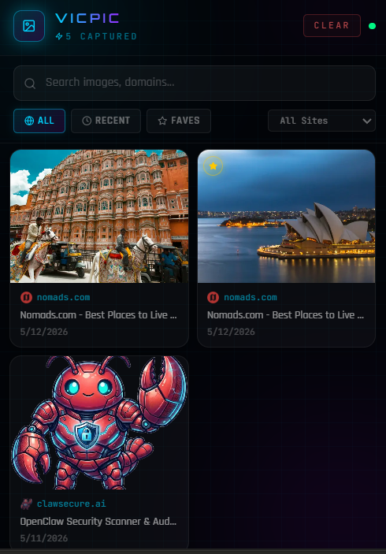

<p align="center">
  
</p>

<h1 align="center">VicPic</h1>

<p align="center">
  A Chrome extension that saves images as you drag them — with a cyberpunk flair.
</p>

<p align="center">
  
  
  
</p>

---

> **Drag any image on any webpage → VicPic saves it instantly.** Browse your collection, search by site, mark favorites, and download — all from the extension popup.




---

## Features

- **Drag to save** — drag any image on any website; VicPic captures the URL, page title, domain, and timestamp
- **Duplicate prevention** — the same image URL is never saved twice
- **Neon glow feedback** — a cyberpunk overlay confirms every successful capture in-page
- **Popup gallery** — 2-column grid with search, filters (All / Recent / Favorites), and per-domain filtering
- **Image actions** — favorite ⭐, download ⬇, copy URL 📋, visit source 🔗, delete 🗑
- **Persistent storage** — saved to `chrome.storage.local`; survives browser restarts

---

## Installation

### Load unpacked (development)

1. Clone the repo and build:
   ```bash
   git clone https://github.com/veerprogrammer/vicpic.git
   cd vicpic
   npm install
   npm run build
   ```
2. Open Chrome and go to `chrome://extensions/`
3. Enable **Developer Mode** (toggle in the top-right corner)
4. Click **Load unpacked** and select the `dist/` folder

### Chrome Web Store

> Coming soon.

---

## Development

```bash
npm install        # install dependencies
npm run dev        # watch mode — rebuilds on file changes
npm run build      # production build → dist/
```

The built extension lives in `dist/`. Reload it in `chrome://extensions/` after each build.

---

## Project Structure

```
vicpic/
├── public/
│   ├── manifest.json          # Chrome Extension Manifest V3
│   └── icons/                 # Extension icons (16, 32, 48, 128px)
├── src/
│   ├── background/
│   │   └── index.ts           # Service worker — handles storage & messaging
│   ├── content/
│   │   └── index.ts           # Content script — drag detection & UI feedback
│   ├── popup/
│   │   ├── index.tsx          # React entry point
│   │   ├── App.tsx            # Root app component
│   │   ├── popup.html         # HTML template
│   │   ├── styles.css         # Global styles + Tailwind
│   │   ├── components/        # Header, SearchBar, ImageGallery, ImageCard, …
│   │   ├── hooks/
│   │   │   └── useImages.ts   # Data loading + action hooks
│   │   └── store/
│   │       └── useVicPicStore.ts  # Zustand global state
│   └── shared/
│       ├── types/index.ts     # TypeScript interfaces
│       └── storage/index.ts   # chrome.storage.local utilities
├── webpack.config.js
├── tailwind.config.js
├── tsconfig.json
└── package.json
```

---

## Permissions

| Permission | Why it's needed |
|------------|-----------------|
| `storage` | Persists saved images via `chrome.storage.local` |
| `<all_urls>` | Injects the content script on every website |

---

## Tech Stack

| Layer | Technology |
|-------|-----------|
| UI | React 18 + TypeScript |
| Styling | Tailwind CSS |
| State | Zustand |
| Icons | Lucide React |
| Animations | Framer Motion |
| Bundler | Webpack 5 |
| Extension API | Chrome Manifest V3 |

---

## Contributing

Contributions are welcome! To get started:

1. Fork the repo and create a branch: `git checkout -b my-feature`
2. Make your changes and commit: `git commit -m "feat: describe your change"`
3. Push and open a Pull Request

Please keep PRs focused — one feature or fix per PR makes review much easier.

---

## License

MIT © [Veerprogrammer](https://github.com/Veerprogrammer)